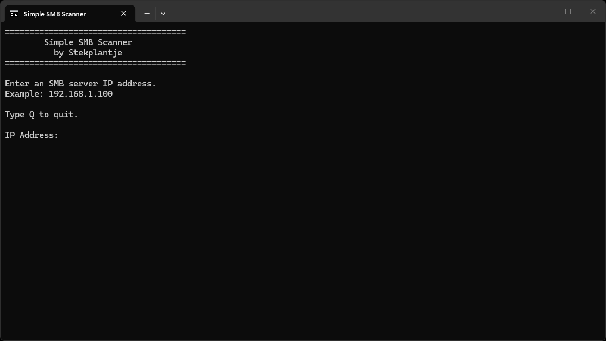

# Simple SMB Scanner

A lightweight Windows batch script for listing SMB shares on a remote host.

## Screenshot

## Features

- Simple and easy to use
- Enter an IP address and scan for SMB shares
- Uses Windows built-in networking tools
- No installation required
- No external dependencies

## Requirements

- Windows
- Network access to the target host
- Appropriate permissions to view SMB shares

## Usage

1. Download `SimpleSMBScanner.bat`
2. Run the script
3. Enter the IP address of the SMB server
4. View the results
   
## License

MIT License
